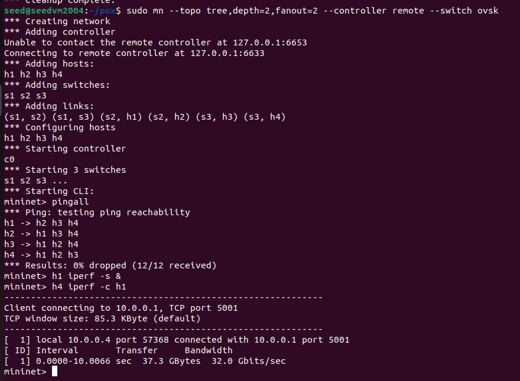
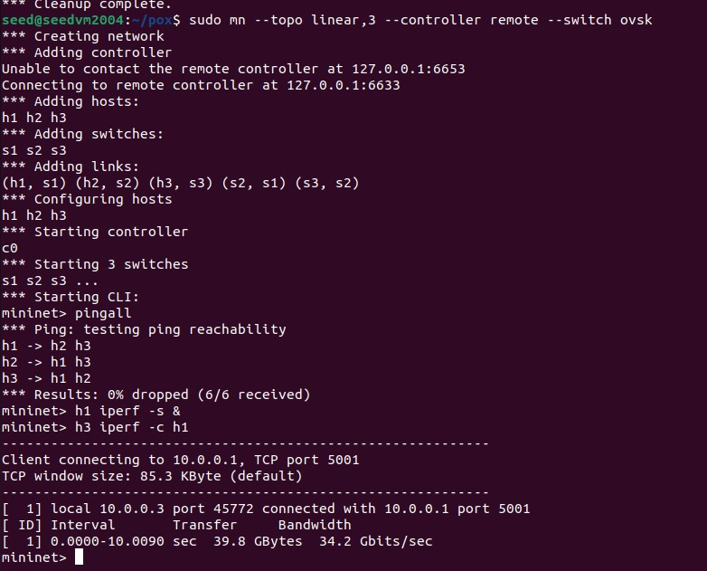
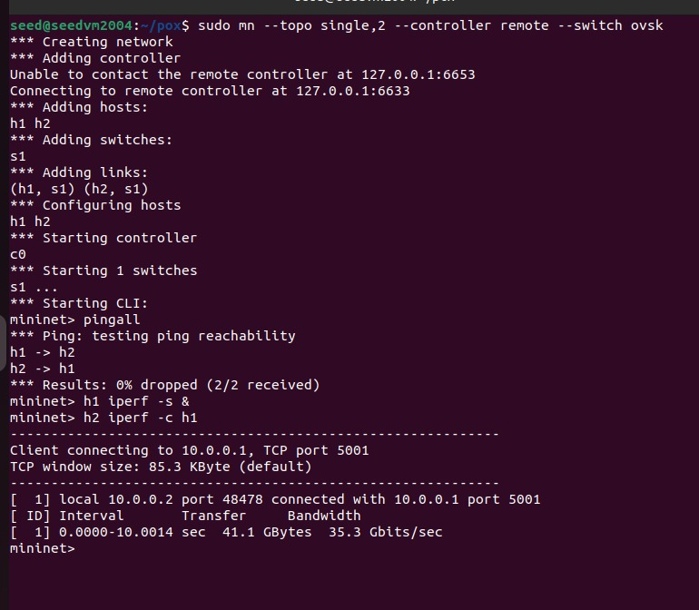
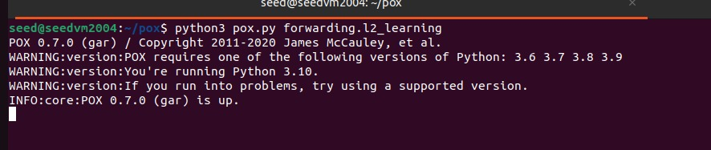

# 🌐 Mininet Bandwidth Measurement & Analysis
### UE24CS252B — Computer Networks

##  Name: Aarush Muralidhara 
##  SRN:  PES1UG24CS010

> Measuring and comparing TCP bandwidth across three Mininet topologies using `iperf`, with a **POX remote controller** and **Open vSwitch (ovsk)**.

---

## 📌 Objective

To measure and compare network bandwidth performance across three different virtual network topologies in Mininet:
- Single Switch Topology
- Linear Topology
- Tree Topology

---

## 🧰 Tools & Environment

| Tool              | Purpose                              |
|-------------------|--------------------------------------|
| Mininet           | Network emulation                    |
| iperf             | TCP bandwidth measurement            |
| POX Controller    | SDN controller (L2 learning)         |
| Open vSwitch (ovsk) | Virtual switch backend             |
| Ubuntu 20.04/22.04 | Host OS (inside VM)                 |
| VMware / VirtualBox | Virtualization platform            |

---

## ⚙️ Setup & Installation

### Step 1: Update system
```bash
sudo apt update
sudo apt upgrade -y
```

### Step 2: Install Mininet
```bash
sudo apt install mininet -y
```

### Step 3: Install iperf
```bash
sudo apt install iperf -y
```

### Step 4: Verify Mininet
```bash
sudo mn --test pingall
```

---

## 🎮 Starting the POX Controller

Before launching any topology, start the **POX SDN controller** with L2 learning:

```bash
cd ~/pox
python3 pox.py forwarding.l2_learning
```

**Screenshot — POX Controller Running:**



> POX 0.7.0 (gar) starts up and listens for switch connections on port 6633.

---

## 🔬 Experiment Methodology

Each topology was tested as follows:
1. POX controller started in a separate terminal
2. Mininet launched with `--controller remote --switch ovsk`
3. `pingall` run first to verify connectivity (0% packet loss)
4. `h1 iperf -s &` starts iperf server on h1
5. Client host runs `iperf -c h1` for 10 seconds
6. Bandwidth and transfer recorded from output

---

## 🗂️ Topologies & Results

---

### 1️⃣ Single Switch Topology

**Command:**
```bash
sudo mn --topo single,2 --controller remote --switch ovsk
```

**Inside Mininet CLI:**
```
mininet> pingall
mininet> h1 iperf -s &
mininet> h2 iperf -c h1
```

**Topology:**
```
h1 ──┐
     s1
h2 ──┘
```

**Result:**
| Interval       | Transfer    | Bandwidth      |
|----------------|-------------|----------------|
| 0.0–10.0 sec   | 41.1 GBytes | 35.3 Gbits/sec |

**Screenshot:**



---

### 2️⃣ Linear Topology

**Command:**
```bash
sudo mn --topo linear,3 --controller remote --switch ovsk
```

**Inside Mininet CLI:**
```
mininet> pingall
mininet> h1 iperf -s &
mininet> h3 iperf -c h1
```

**Topology:**
```
h1──s1──s2──s3──h3
        |
        h2
```

**Result:**
| Interval       | Transfer    | Bandwidth      |
|----------------|-------------|----------------|
| 0.0–10.0 sec   | 39.8 GBytes | 34.2 Gbits/sec |

**Screenshot:**



---

### 3️⃣ Tree Topology

**Command:**
```bash
sudo mn --topo tree,depth=2,fanout=2 --controller remote --switch ovsk
```

**Inside Mininet CLI:**
```
mininet> pingall
mininet> h1 iperf -s &
mininet> h4 iperf -c h1
```

**Topology:**
```
        s1
       /   \
     s2     s3
    /  \   /  \
   h1  h2 h3  h4
```

**Result:**
| Interval       | Transfer    | Bandwidth      |
|----------------|-------------|----------------|
| 0.0–10.0 sec   | 37.3 GBytes | 32.0 Gbits/sec |

**Screenshot:**



---

## 📊 Comparison Table

| Topology       | Transfer (GB) | Bandwidth (Gbits/sec) | Rank   |
|----------------|---------------|-----------------------|--------|
| Single Switch  | 41.1          | 35.3                  | 🥇 1st |
| Linear         | 39.8          | 34.2                  | 🥈 2nd |
| Tree           | 37.3          | 32.0                  | 🥉 3rd |

---

## 📈 Analysis

- **Single switch topology** achieved the **highest bandwidth (35.3 Gbits/sec)** — all hosts connect directly to one switch with zero intermediate hops.

- **Linear topology** came second (34.2 Gbits/sec) — packets traverse multiple switches in series, adding small per-hop latency and processing overhead.

- **Tree topology** had the **lowest bandwidth (32.0 Gbits/sec)** — traffic must pass through multiple switch layers (root → child → host), creating the most overhead.

- The bandwidth drop from single to tree is approximately **3.3 Gbits/sec (~9.3%)**, demonstrating that **hop count and topology depth directly impact throughput** even in a virtualized environment.

- All three topologies confirmed **0% packet loss** via `pingall` before iperf testing.

---

## 🗃️ Repository Structure

```
mininet-bandwidth-analysis/
├── README.md
├── scripts/
│   ├── run_single_topo.sh
│   ├── run_linear_topo.sh
│   └── run_tree_topo.sh
├── results/
│   └── bandwidth_results.md
└── screenshots/
    ├── ss-1.jpeg        ← Tree topology result
    ├── ss-2.jpeg        ← Linear topology result
    ├── ss-3.jpeg        ← Single topology result
    └── ss-4.jpeg        ← POX controller running
```

---

## 🚀 How to Run

### Terminal 1 — Start POX Controller:
```bash
cd ~/pox
python3 pox.py forwarding.l2_learning
```

### Terminal 2 — Run experiment:
```bash
# Single topology
sudo mn --topo single,2 --controller remote --switch ovsk

# Linear topology
sudo mn --topo linear,3 --controller remote --switch ovsk

# Tree topology
sudo mn --topo tree,depth=2,fanout=2 --controller remote --switch ovsk
```

### Cleanup after each test:
```bash
sudo mn -c
```

---

## 🛠️ Troubleshooting

| Issue | Fix |
|-------|-----|
| `mn: command not found` | `sudo apt install mininet -y` |
| `iperf: command not found` | `sudo apt install iperf -y` |
| Cannot contact remote controller | Make sure POX is running in another terminal |
| Open vSwitch errors | `sudo apt install openvswitch-switch -y` |
| Permission denied | Always run Mininet with `sudo` |

---

## 📚 References

1. [Mininet Official Overview](https://mininet.org/overview/)
2. [Mininet Walkthrough](https://mininet.org/walkthrough/)
3. [POX Controller Documentation](https://noxrepo.github.io/pox-doc/html/)
4. [Mininet GitHub](https://github.com/mininet/mininet)

---

**Course:** Computer Networks — UE24CS252B  
**Institution:** PES University
